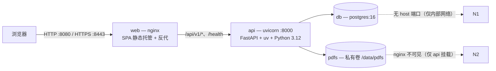

# Lexoria

Lexoria 的根级部署与文档。生产形态为 **Postgres + API + Web(nginx)** 三个长期服务；
按设计**不包含** worker / Celery / Redis。

## 架构总览



| 服务 | 镜像/来源 | 职责 | 对外端口 |
|---|---|---|---|
| `db` | `postgres:16` | 数据库（仅容器网络内可达） | 无 |
| `api` | `apps/api/Dockerfile` | FastAPI（`app.main:app`，:8000），启动前 `alembic upgrade head`，生成 PDF | 无（经 web 反代） |
| `web` | `apps/web/Dockerfile` | 多阶段构建前端 → nginx 静态托管 + 反代 API | `${HTTP_PORT:-8080}:80`、`${HTTPS_PORT:-8443}:443` |

## 目录结构

```
.
├── .dockerignore                # 根级构建上下文排除（web 镜像 context 为仓库根）
├── docker-compose.yml          # 生产编排（仅 db / api / web）
├── docker-compose.dev.yml      # 本地开发：仅 postgres，映射 127.0.0.1:5432
├── .env.example                # 全部环境变量模板（复制为 .env）
├── infra/nginx/
│   ├── nginx.conf              # 默认配置：纯 HTTP + SPA fallback + 安全头 + 登录限流
│   ├── nginx.https.example.conf# HTTPS 示例（证书 + 80→443 跳转 + HSTS）
│   └── certs/                  # 证书挂载目录（gitignored，勿提交私钥）
├── apps/api/Dockerfile         # Python 3.12 slim + uv + WeasyPrint 系统依赖 + Noto CJK
└── apps/web/Dockerfile         # pnpm monorepo 多阶段构建（context=仓库根）→ nginx
```

## 快速开始（生产）

```bash
cp .env.example .env            # 至少修改 POSTGRES_PASSWORD、JWT_SECRET
docker compose up -d --build
docker compose ps               # 三个服务 health 后为 running/healthy
# 打开 http://localhost:8080 （默认纯 HTTP，见下方 HTTPS 一节）
```

构建前提（镜像依赖各 app 的就绪代码；以下假设如与实际不符，改对应 Dockerfile）：
- **api**（context `./apps/api`）：`pyproject.toml` + 提交的 `uv.lock`；入口 `app.main:app`，启动先 `alembic upgrade head`，含 alembic 迁移目录与配置。
- **web**（context 为仓库根）：根目录提交 `pnpm-lock.yaml`；`apps/web/package.json`（`@lexoria/web`）构建脚本输出 `apps/web/dist`；`packages/*` 作为 workspace 依赖参与构建。

默认从容器内访问 `http://localhost:8080`（nginx 同源反代 `/api/v1/*` 与 `/health`），
因此 `ALLOWED_ORIGINS` 默认值 `http://localhost:8080` 即可直接工作。

## HTTPS（可选；开发默认 HTTP 已如上说明）

1. 放置证书到 `infra/nginx/certs/`（容器内为 `/etc/nginx/certs`），默认文件名
   `server.crt` / `server.key`（可自行改配置里的路径）：
   ```bash
   openssl req -x509 -nodes -newkey rsa:2048 \
     -keyout infra/nginx/certs/server.key -out infra/nginx/certs/server.crt \
     -days 365 -subj "/CN=your.domain"     # 测试自签；生产请用真实 CA 证书链
   ```
2. 切换 nginx 配置并更新相关环境变量：
   ```dotenv
   NGINX_CONF=./infra/nginx/nginx.https.example.conf
   ALLOWED_ORIGINS=https://your.domain
   COOKIE_SECURE=true
   HTTP_PORT=80
   HTTPS_PORT=443
   ```
3. 生效：`docker compose up -d web`

HTTPS 示例配置包含 TLSv1.2/1.3、80→443 跳转、HSTS 与完整安全头。默认 HTTP 配置
无需任何证书即可运行，适合开发与内网。

## 本地开发

只启动 Postgres，API / 前端在宿主机上直接跑（热重载友好）：

```bash
docker compose -f docker-compose.dev.yml up -d     # postgres 映射 127.0.0.1:5432
cd apps/api && uv sync
uv run alembic upgrade head
uv run uvicorn app.main:app --reload --port 8000   # DATABASE_URL 用 .env 里的 localhost 值
# 前端（根目录 pnpm monorepo；dev server 与包管理器按实际脚本调整）
pnpm install
pnpm dev                                           # = pnpm --filter @lexoria/web dev
```

> 注意：`docker-compose.dev.yml` 的 DB 密码回退为 `lexoria_dev_password`（仅当
> `POSTGRES_PASSWORD` 未设置时）；DB 卷与生产（`lexoria-dev` 项目）相互隔离。

## 环境变量

| 变量 | 必填 | 默认 | 说明 |
|---|---|---|---|
| `POSTGRES_USER` / `POSTGRES_DB` | 否 | `lexoria` | db 服务账号与库名 |
| `POSTGRES_PASSWORD` | 是（生产） | — | db 密码；生产 compose 未设置即报错 |
| `DATABASE_URL` | 否* | 见示例 | 宿主机直连/alembic 用（localhost:5432）。**生产 compose 忽略之**，由 `POSTGRES_*` 自动派生容器内 URL（`@db:5432`），无需修改。scheme 为同步驱动 `postgresql+psycopg://` |
| `JWT_SECRET` | 是（生产） | — | 签名密钥，长随机串 |
| `ALLOWED_ORIGINS` | 否 | `http://localhost:8080` | 逗号分隔的允许来源（CORS/cookie），HTTPS 后改为 `https://<域名>` |
| `COOKIE_SECURE` | 否 | `false` | 认证 cookie 的 Secure 标记；生产 HTTPS 下必须 `true` |
| `ALLOW_REGISTRATION` | 否 | `true` | 公网实例建议 `false` |
| `PDF_STORAGE_DIR` | 否 | `/data/pdfs` | 容器内 PDF 存储目录，须与 compose 卷挂载点一致 |
| `HTTP_PORT` / `HTTPS_PORT` | 否 | `8080` / `8443` | 映射到 web 容器 80 / 443 |
| `NGINX_CONF` | 否 | `./infra/nginx/nginx.conf` | 挂载进 web 容器的 nginx 配置（切 HTTPS 用） |

## PDF 私有存储

- 生成物写入命名卷 `pdfs`，**只挂载到 `api`**（目标 `${PDF_STORAGE_DIR:-/data/pdfs}`）。
- `web`(nginx) **不挂载**该卷、也没有任何静态路径指向它 —— PDF 绝不会被 nginx 直接暴露，
  只能通过 API 的鉴权端点下载。
- 卷名：`lexoria_pdfs`（`docker compose down` 不会删除卷；`down -v` 会，慎用）。

## 备份与恢复

备份 = **数据库转储 + PDF 卷**两部分，缺一不可。

```bash
mkdir -p backup
# 1) Postgres（结构 + 数据；-Fc 自定义格式便于 pg_restore）
docker compose exec -T db pg_dump -U "${POSTGRES_USER:-lexoria}" -d "${POSTGRES_DB:-lexoria}" -Fc \
  > "backup/lexoria-$(date +%F).dump"
# 2) PDF 卷（tar 流式打包）
docker run --rm -v lexoria_pdfs:/data -v "$(pwd)/backup:/backup" alpine \
  sh -c "tar czf /backup/pdfs-$(date +%F).tar.gz -C /data ."
# 建议同时把两份文件拷离本机（异地/对象存储）。
```

恢复（新机器或灾难恢复）：

```bash
docker compose up -d db api web          # 或仅先起 db/api 也可
docker compose stop api                  # 恢复期间停止写入（PDF 卷恢复前）
# 1) 数据库：对空库直接导入
docker compose exec -T db pg_restore -U "${POSTGRES_USER:-lexoria}" -d "${POSTGRES_DB:-lexoria}" \
  < backup/lexoria-YYYY-MM-DD.dump
#    （若库中已有数据且想覆盖：加 --clean --if-exists）
# 2) PDF 卷
docker run --rm -v lexoria_pdfs:/data -v "$(pwd)/backup:/backup" alpine \
  sh -c "rm -rf /data/* && tar xzf /backup/pdfs-YYYY-MM-DD.tar.gz -C /data"
docker compose up -d --wait
```

说明：完整数据库转储已含 schema，无需再跑迁移；`alembic upgrade head` 仅在新库
（未用转储初始化）时于 API 容器启动时自动执行。恢复后可用 `docker compose ps`
与访问 `/health` 验证。

## 运维

```bash
docker compose ps                 # 健康状态（db/api/web 均有 healthcheck）
docker compose logs -f api        # 跟踪日志
docker compose up -d --build      # 拉新代码后滚动更新（含镜像重建）
docker compose down               # 停止（保留卷）；down -v 会删除 pgdata/pdfs，慎用
```

- 登录限流：nginx `limit_req_zone`（内存实现，无 Redis），默认 `10r/m` 对
  `/api/v1/auth/login`（如实际登录路径不同，改 `infra/nginx/nginx.conf` 中该
  regex location）。
- 安全头（CSP、nosniff、frame/referrer/permissions、HSTS[HTTPS]）作用于前端页面。
- API 请求头由 nginx 补充 `X-Forwarded-*`，uvicorn 以 `--proxy-headers` 启动。
